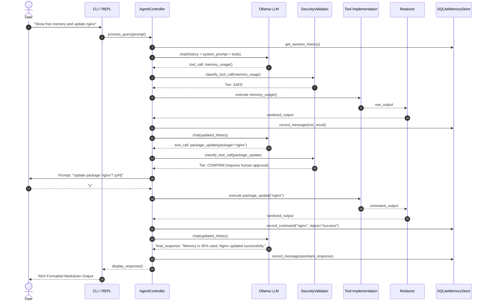

# Linux Command Pilot Architecture

This document describes the high-level architecture, subsystem boundaries, data flow, and design patterns of **Linux Command Pilot**.

---

## 1. High-Level System Architecture

Linux Command Pilot is designed around a strict principle: **The LLM is an untrusted reasoning engine.** 
Every command, tool invocation, file path, and parameter generated by the model must pass through an independent, deterministic Python security enforcement layer before execution.

```mermaid
flowchart TD
    User([User Prompt / Query]) --> CLI[CLI / REPL Interface]
    CLI --> Agent[Agent Controller]
    
    subgraph Agent Loop
        Agent --> Context[Context & Memory Builder]
        Context --> LLM[Local LLM Client (Ollama)]
        LLM --> Decision{Model Output}
        Decision -- Final Response --> Responder[Format & Display Output]
        Decision -- Proposed Tool Call --> SecFilter{Security Layer}
    end

    subgraph Security Layer
        SecFilter --> CheckPath[Path Checker]
        SecFilter --> ArgvVal[Argv & Command Validator]
        SecFilter --> SudoGuard[Sudo Policy & Danger Analysis]
        CheckPath & ArgvVal & SudoGuard --> TierCheck{Risk Tier}
        TierCheck -- BLOCKED --> BlockedHandler[Outright Rejection]
        TierCheck -- CONFIRM --> UserPrompt[Prompt User with Diff / Warning]
        TierCheck -- SAFE --> Executor[Tool Executor]
    end

    UserPrompt -- Approved (y) --> Executor
    UserPrompt -- Denied (N) --> AbortHandler[Abort & Return Error]

    subgraph Execution & Sanitization
        Executor --> ToolRegistry[Tool Registry & Implementations]
        ToolRegistry --> Redactor[Secret Redactor]
        Redactor --> MemStore[(SQLite Memory Store)]
        Redactor --> Agent
    end

    BlockedHandler --> Agent
    AbortHandler --> Agent
    Responder --> User
```

---

## 2. Core Subsystems

### 2.1 CLI and Interactive REPL (`pilot/main.py`, `pilot/ui/`)
- Built using **Typer** and **Rich**.
- **Commands**:
  - `pilot` (default): Launches the interactive REPL shell with multiline input, persistent history, and dynamic slash commands (`/reset`, `/clear`, `/exit`, `/history`).
  - `pilot ask "<query>"`: Non-interactive single-turn or multi-turn execution.
  - `pilot explain "<command>"`: Detailed explanation of Linux commands, flags, and potential risks without executing.
  - `pilot tools`: Dynamic table displaying all registered tools, their risk tiers, and capabilities.
  - `pilot doctor`: Comprehensive diagnostics check verifying Python version, Ollama daemon reachability, model availability, tool registrations, SQLite database status, and distro package manager.
  - `pilot history`: Inspection of past user queries and executed commands.
  - `pilot reset-memory`: Wipes persistent SQLite memory and triggers database compaction (`VACUUM`).

### 2.2 Agent Controller (`pilot/agent/controller.py`)
The `AgentController` coordinates the agent reasoning loop:
1. **Context Assembly**: Retrieves recent conversation history from `ConversationMemory` and formats system prompts with current OS details, user, working directory, and tool schemas.
2. **Model Invocation**: Sends context to the local Ollama LLM.
3. **Tool Call Parsing**: Parses JSON function calls emitted by the model.
4. **Security Validation**: Before executing any tool, calls `SecurityValidator.classify_tool_call()` and `PathChecker.validate_path()`.
5. **Execution & Feedback**: Executes authorized tools, sanitizes the raw output through `redact_secrets()`, and adds the tool result message to the conversation history.
6. **Termination Conditions**: The loop terminates when the model returns a final text response (no tool calls), when `MAX_AGENT_STEPS` is reached, or when a tool execution fails critically.

### 2.3 LLM Provider Abstraction (`pilot/llm/`)
- `BaseLLM`: Abstract base class defining the provider interface:
  - `chat(messages, tools=None)`: Synchronous or asynchronous structured chat completion.
  - `stream_chat(messages, tools=None)`: Streaming token delivery for responsive terminal UX.
- `OllamaLLM`: Concrete implementation communicating with the local Ollama daemon (`http://localhost:11434`):
  - Converts tool registry schemas into Ollama function calling specifications.
  - Implements connection retries, timeout handling, and model availability validation.

### 2.4 Tool Framework & Registry (`pilot/tools/`)
The tool subsystem defines a modular, schema-driven interface for all Linux capabilities:
- `RiskTier` Enum: `SAFE` (auto-executable), `CONFIRM` (requires human approval), `BLOCKED` (prohibited).
- `Tool` dataclass: Encapsulates function metadata, argument validation via Pydantic, description, risk tier, and the callable implementation.
- `ToolRegistry`: Registry holding all available tools:
  - Supports automatic discovery via the `@register_tool` decorator.
  - Generates OpenAI/Ollama-compliant JSON schemas for tool definitions.
  - Provides runtime lookup and dispatch.

#### Registered Tool Suites (15 Tools):
1. **System Inspection (Safe)**:
   - `system_info`: Kernel, distro, uptime, CPU count, architecture.
   - `disk_usage`: Partition mount points, used/free space, percentages.
   - `memory_usage`: Free, used, cached RAM and swap metrics.
   - `process_list`: Top processes sorted by CPU or memory usage.
   - `network_info`: Active network interfaces, IP addresses, default routes.
2. **Filesystem Operations (Safe / Confirm)**:
   - `list_directory`: Directory browsing restricted to `ALLOWED_PATHS` (Safe).
   - `read_file`: Content inspection restricted to `ALLOWED_PATHS` with secret redaction (Safe).
   - `search_files`: Pattern-based file search within allowed boundaries (Safe).
   - `write_file`: File creation or modification with mandatory unified diff display, confirmation prompt, and automatic `.bak.<timestamp>` backups (Confirm).
3. **Package Management (Safe / Confirm)**:
   - `is_package_installed`: Fast status check (Safe).
   - `package_search`: Query repository for package availability (Safe).
   - `package_install`: Distro-agnostic installation (Confirm).
   - `package_remove`: Package uninstallation (Confirm).
   - `package_update`: Package cache and system upgrade (Confirm).
4. **Controlled Terminal Execution (Confirm / Blocked)**:
   - `execute_command`: Direct execution of validated shell commands passing through argv parsing and security filters (Confirm).

### 2.5 Security Enforcement Subsystem (`pilot/security/`)
The security layer operates independently between the LLM and the OS:
- `SecurityValidator`:
  - Parses command strings into tokens using `shlex.split()`.
  - Classifies commands against blacklists, destructive arguments (e.g. `rm -rf /`, `mkfs`, `dd`), credential harvesting targets, and fork bombs.
  - Enforces `CONFIRM` on privilege escalation (`sudo`).
  - Guards the Pilot codebase itself against tampering or deletion.
- `PathChecker`:
  - Resolves symlinks and canonicalizes paths (`pathlib.Path.resolve()`).
  - Blocks directory traversal attacks (`..`).
  - Restricts access to configurable `ALLOWED_PATHS`.
  - Enforces prohibited system targets (`/proc`, `/sys`, `/dev`, `/boot`, `/etc/shadow`, `~/.ssh`).
- `Redactor`:
  - Regex-based engine scanning strings for private keys, tokens, passwords, AWS IDs, database URIs, and credentials.
  - Redacts sensitive values before they reach LLM prompts, terminal logs, or the persistent SQLite database.

### 2.6 Memory & Persistence Subsystem (`pilot/memory/`)
- `ConversationMemory`: Short-term in-memory sliding window holding recent dialog turns. Enables multi-turn context and pronoun resolution.
- `SQLiteMemoryStore`: Persistent SQLite store (`~/.config/linux-command-pilot/pilot.db`):
  - Tables: `sessions`, `messages`, `command_history`.
  - Zero-Secret Guarantee: Recursively passes all message contents, arguments, and outputs through `redact_secrets()` prior to executing database write operations.
  - Vacuum & compaction support via `reset_memory()`.

### 2.7 Distro Package Manager Abstraction (`pilot/tools/packages.py`)
- Python `Protocol` defining: `install()`, `remove()`, `search()`, `update()`, `is_installed()`.
- Concrete drivers:
  - `AptPackageManager`: Debian, Ubuntu, Linux Mint (`apt-get`, `dpkg-query`).
  - `DnfPackageManager`: Fedora, RHEL, CentOS, Rocky Linux (`dnf`, `rpm`).
  - `PacmanPackageManager`: Arch Linux, Manjaro (`pacman`).
- Automatic detection via `/etc/os-release` and binary availability checks in `PATH`.
- Sanitizes package names to prevent option injection (rejecting leading dashes or special characters).

---

## 3. Request Lifecycle

The diagram below illustrates the detailed execution sequence for a user query:


