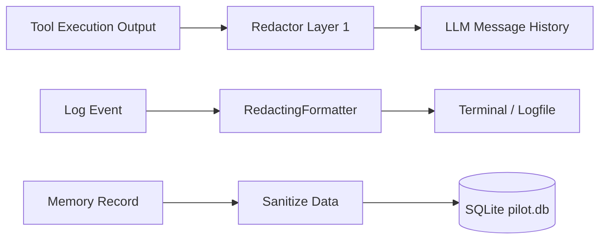

# Linux Command Pilot Security Specification

This document provides a comprehensive breakdown of the security model, threat mitigations, validation pipelines, and architectural safeguards built into **Linux Command Pilot**.

---

## 1. Core Principles & Threat Model

### 1.1 Core Principles
1. **Safety > Correctness > Transparency > Minimal Change > User Intent > Efficiency**:
   Safety is never compromised for agent autonomy. If an action could endanger system integrity or leak credentials, it must be either confirmed by a human or blocked outright.
2. **The LLM is Untrusted Input**:
   Every string, argument, path, command, and option proposed by the model is considered potentially malicious or hallucinated. No raw LLM string is executed without passing through deterministic Python security validators.
3. **Defense in Depth**:
   Security is enforced at multiple layers: path canonicalization, command tokenization, risk tier classification, secret redaction, and database sanitization.

### 1.2 Threat Model & Mitigations

| Threat Vector | Description | Pilot Mitigation |
|---|---|---|
| **Prompt Injection / Jailbreak** | Malicious text in a logfile, webpage, or prompt attempts to override system instructions. | The LLM cannot directly invoke OS primitives. All commands go through `SecurityValidator` which blocks dangerous commands regardless of prompt intent. |
| **Catastrophic Deletion** | Accidental or malicious execution of `rm -rf /` or mass file overwrites. | Strict blacklist of destructive commands and paths (`/`, `/*`, `/etc`, `/boot`, `/sys`, etc.) classified as `BLOCKED`. |
| **Privilege Escalation** | Tool attempts unauthorized execution as `root` via `sudo` or setuid binaries. | All `sudo` invocations unconditionally require explicit user confirmation (`CONFIRM`). System files (`/etc/sudoers`) are strictly blocked from modification. |
| **Credential Harvesting** | LLM tries to read SSH keys, password hashes, bash history, or cloud tokens. | Sensitive paths (`~/.ssh`, `/etc/shadow`, `/proc/kcore`, `.bash_history`) are blocked. Secret redactor strips credentials from tool outputs before LLM sees them. |
| **Secret Leakage in Logs / DB** | Passwords, tokens, or API keys leaked into local log files or SQLite memory. | Multi-layer redactor scrubs all inputs before logging (`RedactingFormatter`) or saving to SQLite (`SQLiteMemoryStore.sanitize_data`). |
| **Directory Traversal** | Path manipulation using `../` or symlinks pointing outside allowed boundaries. | `PathChecker` canonicalizes all paths with `Path.resolve()` and verifies containment within `ALLOWED_PATHS`. |
| **Shell Metacharacter Injection** | Embedding `;`, `&&`, `|`, `$(...)`, or backticks to bypass filters. | Commands are tokenized via `shlex.split()`. Shell chaining and subshell expressions are individually parsed and inspected. |
| **Codebase Self-Tampering** | Model attempts to edit `pilot/security/` to disable validation checks. | `SecurityValidator` explicitly blocks modifications targeting the Pilot package directory. |

---

## 2. 3-Tier Classification Model

Every proposed action falls into one of three distinct risk tiers:

```
┌─────────────────────────────────────────────────────────────┐
│                       Proposed Action                       │
└──────────────────────────────┬──────────────────────────────┘
                               │
               ┌───────────────┴───────────────┐
               ▼                               ▼
       [Is It Destructive?            [Is It Purely Read-Only
     Or Credential Target?]             & Non-Destructive?]
               │                               │
        YES ───┴─── NO                   YES ──┴─── NO
         │           │                    │          │
         ▼           ▼                    ▼          ▼
    [BLOCKED]   [CONFIRM]              [SAFE]    [CONFIRM]
   Unconditional Explicit User      Auto-Execute Explicit User
    Rejection    Approval (y/N)                   Approval (y/N)
```

### 2.1 SAFE (Autonomous Execution)
Operations that read system state without modifying files, services, packages, or configurations:
- **Baseline Tools**: `system_info`, `disk_usage`, `memory_usage`, `process_list`, `network_info`.
- **Filesystem Tools**: `list_directory`, `read_file`, `search_files` (restricted to `ALLOWED_PATHS`).
- **Package Tools**: `is_package_installed`, `package_search`.
- **Safe Commands**: `cat`, `ls`, `grep`, `uptime`, `df`, `free`, `ps`, `ip`, `uname`, `which`.

### 2.2 CONFIRM (Explicit Human Approval Required)
State-modifying operations that could alter system behavior, install software, or write files:
- **Filesystem**: `write_file` (displays a unified diff and creates `.bak.<timestamp>` backup).
- **Package Management**: `package_install`, `package_remove`, `package_update`.
- **System Administration**: `systemctl restart`, `systemctl stop`, `service`, `ufw`, `iptables`.
- **Shell Commands**: General commands passed to `execute_command` that modify state or invoke `sudo`.
- **User Prompt**: The user is presented with the command, the justification, risk assessment, and any file diffs before being asked `[y/N]`. Defaults to `N`.

### 2.3 BLOCKED (Unconditional Rejection)
Catastrophic or dangerous actions that are terminated immediately with zero execution:
- **Mass Deletion**: `rm -rf /`, `rm -rf /*`, `rm -rf ~`, `rm -rf /etc`, `rm -rf /var`, etc.
- **Disk Wiping & Formatting**: `mkfs`, `fdisk`, `dd if=/dev/... of=/dev/sd...`, `> /dev/sda`.
- **Credential Dumping**: Reading `/etc/shadow`, `/etc/gshadow`, `~/.ssh/id_*`, `~/.bash_history`, `/proc/kcore`.
- **System Disruption**: Fork bombs (`:(){ :|:& };:`), `shutdown`, `reboot`, `init 0`, `poweroff`.
- **Recursive Permission Resets**: `chmod -R 777 /`, `chown -R ... /`.
- **Security Self-Tampering**: Any attempt to write or delete files inside the `pilot/security/` module.

---

## 3. Argv-Level Command Validation

Rather than evaluating strings with arbitrary shell interpreters (`sh -c`), Pilot decomposes commands into structural elements:

1. **Tokenization**:
   Uses `shlex.split()` to split the command line into an argument vector (`argv`), respecting POSIX quotes and escape sequences.
2. **Subshell & Chain Detection**:
   Inspects tokens for command separators (`;`, `&&`, `||`, `|`, `&`) and command substitution (`$(...)`, `` `...` ``). Each segment is extracted and validated independently.
3. **Binary & Flag Analysis**:
   - Matches the primary binary name against known tools.
   - For sensitive commands like `chmod` or `chown`, inspects recursive flags (`-R`, `--recursive`) combined with root target paths.
   - For `rm`, detects `--no-preserve-root` and target paths against blacklist roots.

---

## 4. Path Restriction & Traversal Defense

The `PathChecker` module controls all filesystem interactions:

1. **Canonicalization**:
   Every path argument is converted to an absolute path and resolved through `Path.resolve()` to follow symlinks to their ultimate real target.
2. **Boundary Containment**:
   The resolved target must reside within one of the paths configured in `settings.allowed_paths` (default: current working directory). Any path attempting to escape via `../../` is intercepted and rejected with a `PermissionError`.
3. **Prohibited System Paths**:
   Even if an administrator includes `/` in `ALLOWED_PATHS`, `PathChecker` prohibits writing to or reading sensitive system paths:
   - `/proc`, `/sys`, `/dev`, `/boot`, `/run`
   - `/etc/shadow`, `/etc/gshadow`, `/etc/sudoers`
   - `~/.ssh/id_rsa`, `~/.ssh/id_ed25519`

---

## 5. Multi-Layer Secret Redaction

Linux Command Pilot features an embedded, regex-based secret scrubber (`pilot/security/redactor.py`) that executes across three boundaries:



### 5.1 Redaction Signatures
- **Private Keys**: `-----BEGIN (RSA|EC|OPENSSH|DSA|PRIVATE) KEY-----`
- **AWS Credentials**: `AKIA[0-9A-Z]{16}`, Secret Access Keys
- **GitHub Personal Access Tokens**: `ghp_[0-9a-zA-Z]{36}`, `github_pat_[0-9a-zA-Z_]{82}`
- **Generic Tokens & Keys**: `bearer [A-Za-z0-9_-]+`, `api[_-]?key\s*[:=]\s*["']?[A-Za-z0-9_-]+`
- **Database Connection URIs**: `postgres://...`, `mysql://...`, `mongodb://...`
- **Password Assignments**: `password\s*[:=]\s*["']?[^ \n\r"']+`

### 5.2 Negative Lookahead Collision Prevention
The engine uses negative lookaheads (`(?!(?:\[REDACTED_))`) to prevent double-redacting or corrupting previously replaced placeholders (e.g. `[REDACTED_API_KEY]`).

---

## 6. Safe Modification Pipeline (`write_file`)

Modifying files carries inherent operational risk. Pilot enforces a 3-step guardrail:

1. **Backup Creation**:
   If the target file exists, a backup copy is automatically created at `<filepath>.bak.<timestamp>` before any changes are written.
2. **Unified Diff Display**:
   A colored syntax-highlighted unified diff (`difflib.unified_diff`) is presented to the user showing exactly what lines are being added, changed, or deleted.
3. **Human Confirmation**:
   The user must enter `y` to apply the diff. If denied, the original file is left completely untouched.

---

## 7. Verification & Benchmarking

The security architecture is verified continuously by the test suite:
- **Unit Tests**: 85+ tests in `tests/` asserting correct classification, path rejection, and redaction.
- **Evaluation Benchmark**: 100 tasks in `eval/tasks.jsonl` testing 20 blocked attack vectors (jailbreaks, credential theft, disk wipes). All 20 blocked tasks must pass with **0 security violations**.
